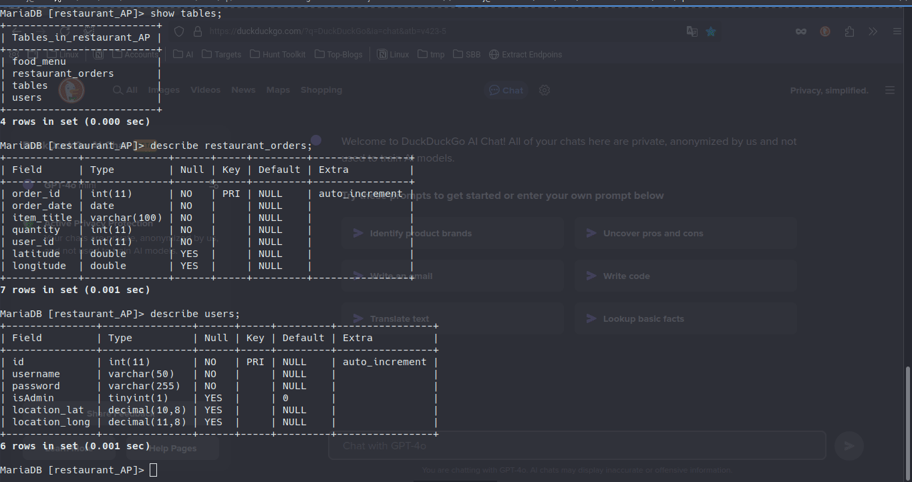

# GUI-AP-Course-2024 (Final Project)
A TUI-based app designed as an interface for interacting with a restaurant, supporting both customer and admin users.
    
- Customer Features:
    - Place orders
    - View previous orders

- Admin Features:
    - Edit food menu
    - Manage tables
    - Extract filtered orders by date, order type, and food menu items

### Usage

